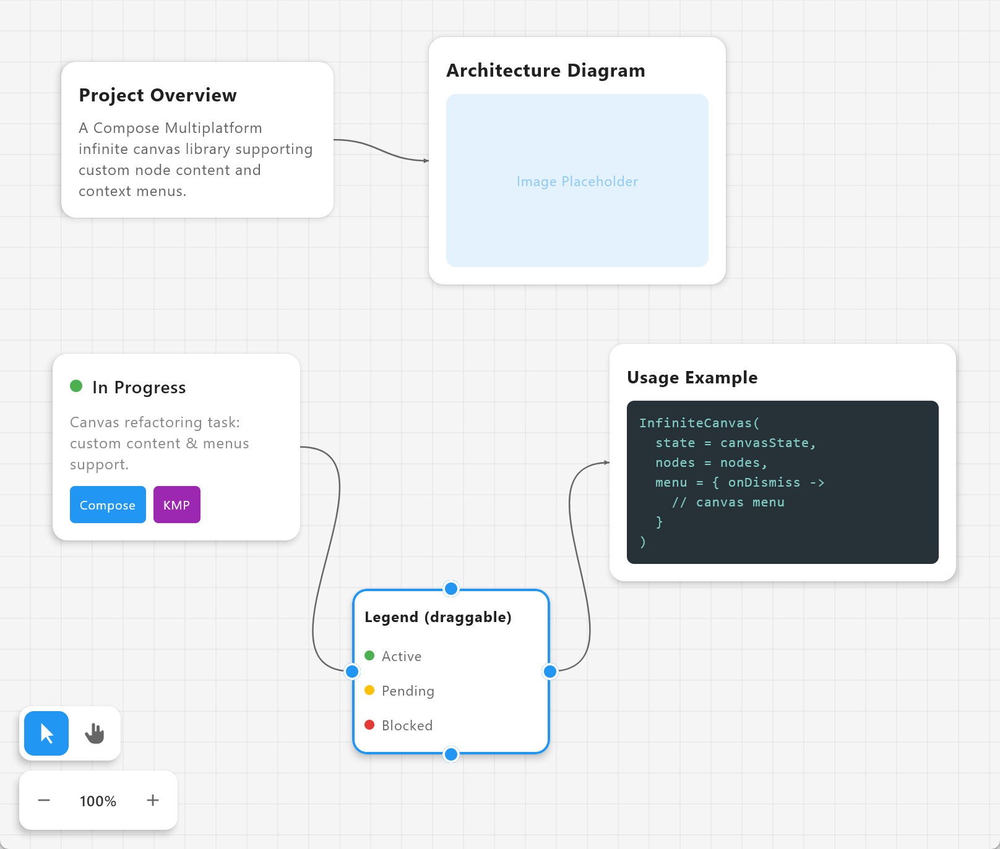

# Compose Infinite Canvas

A Compose Multiplatform infinite canvas library for building node-based editors, whiteboards, and diagram tools.

[中文文档](#中文文档)



## Features

- **Infinite Canvas** — Pan and zoom with no boundaries
- **Custom Node Content** — Each node renders any Composable content you define
- **Custom Context Menus** — Per-node and canvas-level right-click menus
- **Connections** — Bezier curve connections between node anchor points
- **Node Pinning** — `pinToFront` keeps nodes above others, `fixed` prevents dragging (both toggleable at runtime)
- **Dynamic Nodes** — Add and remove nodes at runtime
- **Gestures** — Full gesture support:
  - Click to select, drag to move nodes
  - Drag from anchor to create connections
  - Click connection to delete
  - Box select (drag on empty area)
  - Ctrl+Scroll to zoom, Scroll to pan
  - Pinch to zoom on touch devices
  - Spacebar for temporary pan mode
- **Multiplatform** — Android, iOS, Desktop (JVM), Web (JS/WASM)

## Installation

[](https://central.sonatype.com/artifact/io.github.xingray/compose-infinite-canvas-core)

### Gradle (Kotlin DSL)

```kotlin
implementation("io.github.xingray:compose-infinite-canvas-core:0.2.0")
```

### Gradle Version Catalog

In `gradle/libs.versions.toml`:

```toml
[versions]
composeInfiniteCanvasCore = "0.2.0"

[libraries]
compose-infinite-canvas-core = { module = "io.github.xingray:compose-infinite-canvas-core", version.ref = "composeInfiniteCanvasCore" }
```

Then in your module's `build.gradle.kts`:

```kotlin
implementation(libs.compose.infinite.canvas.core)
```

### Supported Platforms

| Platform | Artifact |
|----------|----------|
| Android | `compose-infinite-canvas-core-android` |
| JVM (Desktop) | `compose-infinite-canvas-core-jvm` |
| iOS Arm64 | `compose-infinite-canvas-core-iosarm64` |
| iOS Simulator | `compose-infinite-canvas-core-iossimulatorarm64` |
| macOS Arm64 | `compose-infinite-canvas-core-macosarm64` |
| macOS X64 | `compose-infinite-canvas-core-macosx64` |
| JS (Browser) | `compose-infinite-canvas-core-js` |
| WASM (Browser) | `compose-infinite-canvas-core-wasmjs` |

> Gradle will automatically resolve the correct platform artifact. No need to specify them manually.

## Usage

```kotlin
import io.github.xingray.compose.infinitecanvas.*

@Composable
fun MyCanvas() {
    val canvasState = rememberInfiniteCanvasState()

    val node1 = rememberCanvasNodeState(x = 100f, y = 100f)
    val node2 = rememberCanvasNodeState(x = 450f, y = 100f)

    val nodes = remember(node1, node2) {
        listOf(
            CanvasNode(
                id = "note-1",
                modifier = Modifier.width(220.dp),
                state = node1,
                content = {
                    Column(Modifier.padding(14.dp)) {
                        Text("Hello", fontWeight = FontWeight.Bold)
                        Text("This is a card on the infinite canvas.")
                    }
                },
                menu = { onDismiss ->
                    // your custom right-click menu
                },
            ),
            CanvasNode(
                id = "note-2",
                modifier = Modifier.width(220.dp),
                state = node2,
                content = {
                    Column(Modifier.padding(14.dp)) {
                        Text("World", fontWeight = FontWeight.Bold)
                        Text("Connect me to the other card!")
                    }
                },
            ),
        )
    }

    InfiniteCanvas(
        modifier = Modifier.fillMaxSize(),
        state = canvasState,
        nodes = nodes,
        menu = { onDismiss ->
            // canvas-level right-click menu
        },
    )
}
```

### Key APIs

| API | Description |
|-----|-------------|
| `InfiniteCanvas(state, nodes, menu)` | Main canvas composable |
| `CanvasNode(id, modifier, state, content, menu)` | Node with custom content and menu |
| `CanvasNodeState(x, y, fixed, pinToFront)` | Mutable node position and behavior |
| `InfiniteCanvasState` | Canvas viewport, selection, connections |
| `InfiniteCanvasConfig` | Visual config (grid, background, controls) |
| `rememberInfiniteCanvasState()` | Remember canvas state |
| `rememberCanvasNodeState(x, y, fixed, pinToFront)` | Remember node state |

## Project Structure

```
compose-infinite-canvas/
├── compose-infinite-canvas-core/   # Library module (publishable)
│   └── src/commonMain/
│       └── io.github.xingray.compose.infinitecanvas/
│           ├── CanvasNode.kt             # Node definition
│           ├── CanvasNodeState.kt        # Node mutable state
│           ├── InfiniteCanvas.kt         # Main composable
│           ├── InfiniteCanvasState.kt    # Canvas state management
│           ├── InfiniteCanvasConfig.kt   # Canvas visual config
│           ├── Connection.kt            # Connection data model
│           ├── ViewportState.kt         # Pan & zoom state
│           ├── MenuPositionUtils.kt     # Menu positioning
│           ├── connection/
│           │   └── ConnectionRenderer.kt    # Bezier curve rendering
│           ├── element/
│           │   └── CardElementView.kt       # Node chrome (border, anchors)
│           └── gesture/
│               └── CanvasGestureHandler.kt  # Gesture handling
├── sample/                # Demo app (KMP: JVM, JS, WASM, Android, iOS)
└── sample-android/        # Android demo app entry point
```

## Build from Source

```bash
# Build the library
./gradlew :compose-infinite-canvas-core:build

# Run the demo app (Desktop)
./gradlew :sample:run
```

## Migration from 0.1.x

The 0.2.0 release is a breaking API change:

| 0.1.x | 0.2.0 |
|-------|-------|
| `CanvasViewModel` | `InfiniteCanvasState` / `rememberInfiniteCanvasState()` |
| `CardElement(title, content)` | `CanvasNode(content = { ... })` |
| `CanvasElement` sealed class | Removed |
| `InfiniteCanvas(viewModel)` | `InfiniteCanvas(state, nodes, menu)` |
| Fixed context menus | Custom per-node and canvas menus |
| Artifact: `compose-infinite-canvas` | Artifact: `compose-infinite-canvas-core` |

## License

This project is open source. See the repository for license details.

---

# 中文文档

一个基于 Compose Multiplatform 的无限画布库，可用于构建节点编辑器、白板和图表工具。


## 功能特性

- **无限画布** — 无边界的平移和缩放
- **自定义节点内容** — 每个节点可渲染任意 Composable 内容
- **自定义右键菜单** — 支持节点级和画布级右键菜单
- **连接线** — 基于贝塞尔曲线的锚点连接
- **节点固定** — `pinToFront` 置顶显示，`fixed` 禁止拖拽（均可运行时切换）
- **动态节点** — 运行时添加和删除节点
- **手势操作** — 完整的手势支持：
  - 点击选中，拖拽移动节点
  - 从锚点拖拽创建连接线
  - 点击连接线删除
  - 框选（在空白区域拖拽）
  - Ctrl+滚轮缩放，滚轮平移
  - 触屏双指缩放
  - 空格键临时切换平移模式
- **多平台** — Android、iOS、桌面端 (JVM)、Web (JS/WASM)

## 安装

[](https://central.sonatype.com/artifact/io.github.xingray/compose-infinite-canvas-core)

### Gradle (Kotlin DSL)

```kotlin
implementation("io.github.xingray:compose-infinite-canvas-core:0.2.0")
```

### Gradle Version Catalog

在 `gradle/libs.versions.toml` 中添加：

```toml
[versions]
composeInfiniteCanvasCore = "0.2.0"

[libraries]
compose-infinite-canvas-core = { module = "io.github.xingray:compose-infinite-canvas-core", version.ref = "composeInfiniteCanvasCore" }
```

然后在模块的 `build.gradle.kts` 中引用：

```kotlin
implementation(libs.compose.infinite.canvas.core)
```

### 支持的平台

| 平台 | Artifact |
|------|----------|
| Android | `compose-infinite-canvas-core-android` |
| JVM (桌面端) | `compose-infinite-canvas-core-jvm` |
| iOS Arm64 | `compose-infinite-canvas-core-iosarm64` |
| iOS Simulator | `compose-infinite-canvas-core-iossimulatorarm64` |
| macOS Arm64 | `compose-infinite-canvas-core-macosarm64` |
| macOS X64 | `compose-infinite-canvas-core-macosx64` |
| JS (浏览器) | `compose-infinite-canvas-core-js` |
| WASM (浏览器) | `compose-infinite-canvas-core-wasmjs` |

> Gradle 会自动解析对应平台的 artifact，无需手动指定。

## 使用示例

```kotlin
import io.github.xingray.compose.infinitecanvas.*

@Composable
fun MyCanvas() {
    val canvasState = rememberInfiniteCanvasState()

    val node1 = rememberCanvasNodeState(x = 100f, y = 100f)
    val node2 = rememberCanvasNodeState(x = 450f, y = 100f)

    val nodes = remember(node1, node2) {
        listOf(
            CanvasNode(
                id = "note-1",
                modifier = Modifier.width(220.dp),
                state = node1,
                content = {
                    Column(Modifier.padding(14.dp)) {
                        Text("你好", fontWeight = FontWeight.Bold)
                        Text("这是无限画布上的一张卡片。")
                    }
                },
                menu = { onDismiss ->
                    // 自定义右键菜单
                },
            ),
            CanvasNode(
                id = "note-2",
                modifier = Modifier.width(220.dp),
                state = node2,
                content = {
                    Column(Modifier.padding(14.dp)) {
                        Text("世界", fontWeight = FontWeight.Bold)
                        Text("把我和另一张卡片连接起来！")
                    }
                },
            ),
        )
    }

    InfiniteCanvas(
        modifier = Modifier.fillMaxSize(),
        state = canvasState,
        nodes = nodes,
        menu = { onDismiss ->
            // 画布级右键菜单
        },
    )
}
```

### 核心 API

| API | 说明 |
|-----|------|
| `InfiniteCanvas(state, nodes, menu)` | 主画布组件 |
| `CanvasNode(id, modifier, state, content, menu)` | 自定义内容和菜单的节点 |
| `CanvasNodeState(x, y, fixed, pinToFront)` | 节点位置和行为的可变状态 |
| `InfiniteCanvasState` | 画布视口、选择、连接线状态 |
| `InfiniteCanvasConfig` | 外观配置（网格、背景、控件） |
| `rememberInfiniteCanvasState()` | 记住画布状态 |
| `rememberCanvasNodeState(x, y, fixed, pinToFront)` | 记住节点状态 |

## 从源码构建

```bash
# 构建库
./gradlew :compose-infinite-canvas-core:build

# 运行示例应用（桌面端）
./gradlew :sample:run
```

## 从 0.1.x 迁移

0.2.0 是破坏性 API 变更：

| 0.1.x | 0.2.0 |
|-------|-------|
| `CanvasViewModel` | `InfiniteCanvasState` / `rememberInfiniteCanvasState()` |
| `CardElement(title, content)` | `CanvasNode(content = { ... })` |
| `CanvasElement` sealed class | 已移除 |
| `InfiniteCanvas(viewModel)` | `InfiniteCanvas(state, nodes, menu)` |
| 固定的右键菜单 | 自定义节点级和画布级菜单 |
| Artifact: `compose-infinite-canvas` | Artifact: `compose-infinite-canvas-core` |
